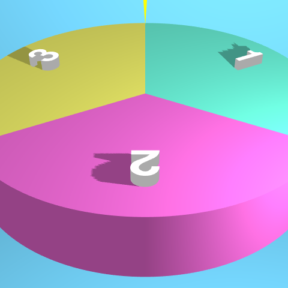

# ランチの候補がルーレット

「陳麻婆豆腐に行きましょう。」  
基本見たままです。大した機能はないです。少しは遊んでやってください。

https://yuichisemura.github.io/lunchNoCohoGaRoulette/

## 機能の説明

ほぼランダムで何かを決めたいときに使えるツールです。ルーレットとは元来そういうものですね。

- 候補リストを最大10まで設定し、ルーレットを使用してその中から1つを選びます。
- START/STOPボタンを押して、ルーレットを操作します。
    - STARTを押すと加速し、STOPを押すと減速します。
    - 速度が0になると、結果が出たことになって、アラートが出ます。
- マウスやタッチ操作を使用して、カメラ操作をすることが出来ます。
    - マウスやタッチではルーレットの結果を操作することは出来ません。
- URLにリスト情報を含めることが出来るため、URLでのリストの復元が可能です。＝他人への共有が簡単に行えます。

## 実装

キャンバス部分に、3Dライブラリの three.js を使用しています。興味があれば見てください。

## 今後の課題

- スマホでの利用を考え、ルーレットのみをズームアップする機能を追加する。
- 飲み会などの利用可能性を考え、接待モードを追加する。
- 白背景と鮮やかな色たちで目がチカチカするため、ダークモードに対応する。（おもちゃ機能）
- 現在、リフレッシュレートが60の端末でベストなパフォーマンスになる設定をしているため、端末依存性を減らす。
